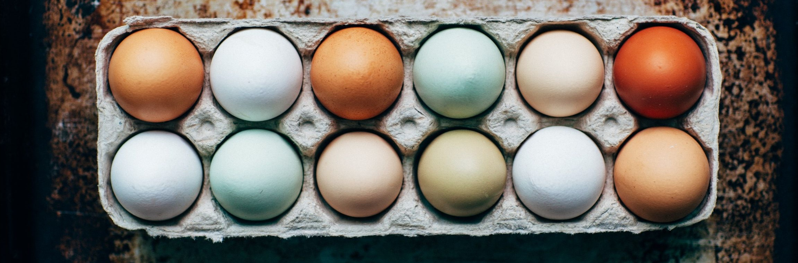
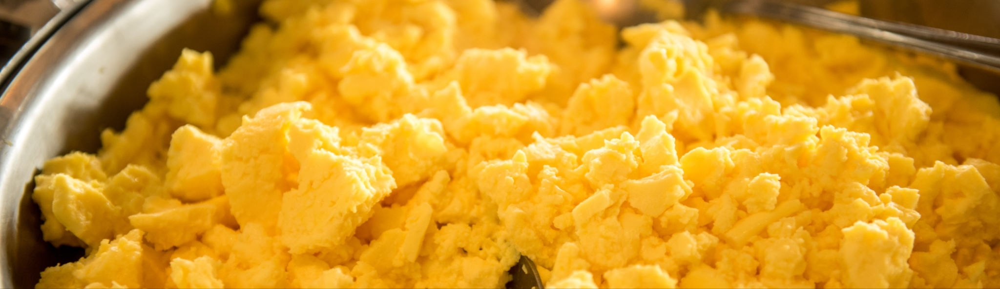

# A ~~Terrible~~ Wonderful Guide to Scrambled Eggs

### You will need:

- A spatula
  - Can be acquired from a fantastical land known as “Grocery Store”
- A frying pan 
  - Can be acquired from Grocery Store
- A fire
  - Can be started with pieces of sharp wood
- A couple of eggs
  - Can be stolen from a chicken/duck
- A little bit of unspoiled milk
  - Can be acquired from Grocery Store
- A bit of salt
  - Can be acquired from drying the tears of a sad homo sapien
- Something that can be used to beat things
  - I recommend chopsticks, if you happen to be fluent in them, but almost any other utensil could work. Can be acquired from Grocery Store
- A reasonably big bowl
  - Can be acquired from Grocery Store
- A bit of oil
  - Can be acquired from Grocery Store

Now, let the cookery BEGINNNN

### Instructions:

1. Put the eggs into the bowl and punch them a few times. If you feel confident enough, you could also crush the egg in your fist while holding it above the bowl. Then, carefully pick out the pieces of egg shell (I assure you, this is the most efficient way). Note: A few pieces of the shell could be left in to add a crunchy texture to the final product.

2. Stick your choice of beating utensil into the bowl of eggs. Beat the eggs up until the color looks evenly yellow and small bubbles are present on the surface. Go full force with the beating -- there is no need to be worried about them getting hurt. Note: If egg shells were left in, then be careful not to crush them too much. They will only give a satisfying crunch if they are large enough (about the size of half your pinky fingernail).

3. Pour some milk into the mixture. Please do not use spoiled milk. It would cause the final product to taste sour. That is not the taste we are aiming for. Also, make sure that there is less milk than egg in the mixture, or else you’d end up just cooking milk.

4. Pinch salt in three fingers. For each egg you used, there should be half a pinch added to the mixture. Warning: If you have big hands, I will not take any responsibility for overly-salted scrambled eggs. Same thing for people with small hands, although your problem would be much easier to fix. Just sprinkle some salt onto the finished product if it tastes too bland.

5. Beat up the mixture some more. This time, you may use hands to do so if you’d like.

6. Put a frying pan on top of the fire. Note: please do not attempt to start a bonfire indoors, it may cause serious injuries to the house.

7. Pour a little bit of oil into the frying pan. Then pour the entire egg mixture into the frying pan as well. It should look flat and ound (or whatever shape your frying pan happens to be in. It could be triangular for all I know, and that would work just fine).

8. Let sit (without putting a lid on top) until you count to thirty. Out loud.

9. Now, slice at the flat egg cake with your spatula vigorously until it becomes smaller, formless blobs instead.

10. Wobble and nudge the blobs around in the pan until they’re cooked.

Aaaand congratulations! You’re done!

Give yourself a pat on the back while you enjoy your freshly made scrambled eggs!

###### For a more detailed tutorial, please visit [this place](https://www.incredibleegg.org/recipes/basic-scrambled-eggs/). Their tutorial is, admittedly, just a liiiittle more wonderful than this one.
